# Домашнее задание №9 (Тема "Резервное копирование и восстановление")

Описание/Пошаговая инструкция выполнения домашнего задания:

* Создаем ВМ/докер c ПГ.
  > 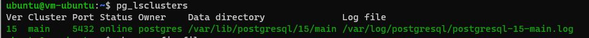
* Создаем БД, схему и в ней таблицу.
  
   __*Создаю базу данных "testdb":*__
  > 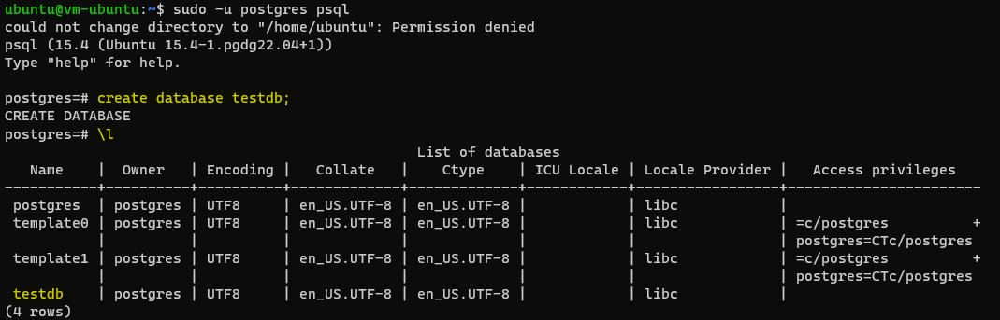
   __*В созданной базе данных создаю схему "schTest":*__
  > 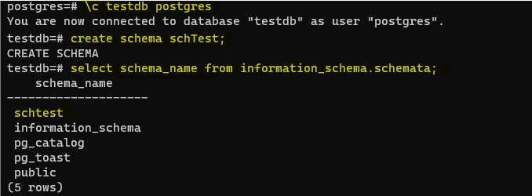
   __*И уже в созданной схеме "schTest" создаю таблицу "test":*__
  > 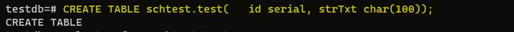

* Заполним таблицы автосгенерированными 100 записями.
  > 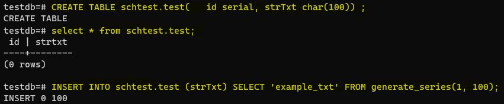
  
* Под линукс пользователем Postgres создадим каталог для бэкапов
  
   __*С помощью рут-пользователя командой «mkdir /home/postgres» я создаю каталог /home/postgres, далее командой «chown postgres /home/postgres» устанавливаю владельцем пользователя postgres этому каталогу. Теперь уже под пользователем postgres там можно создать каталог для бэкапов.*__
  > 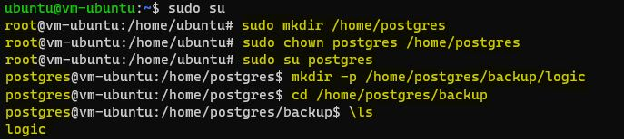
* Сделаем логический бэкап используя утилиту COPY
  
   __*Создаю логический бэкап таблицы "test" с именем "st.sql":*__ 
  > 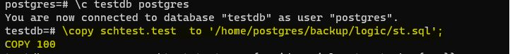
   __*Убеждаюсь, что файл бэкапа создался в нашем каталоге:*__  
  > 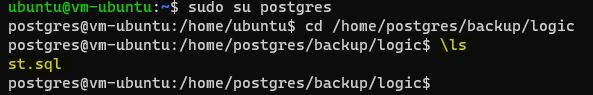
* Восстановим в 2 таблицу данные из бэкапа.
  
   __*Для того, чтобы восстановить данные из бэкапа, вторая таблица "test_copy" должна быть в той же схеме "schTest", как и оригинальная таблица. По этому я создаю таблицу в той же схеме. Команда "\copy ... from ..." выполняется успешно, и таблица "test_copy" теперь с такими же данными, что и таблица "test".*__
  > 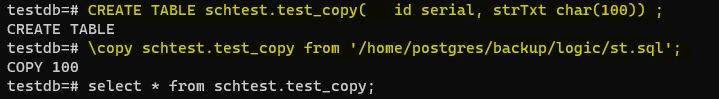
* Используя утилиту pg_dump, создадим бэкап в кастомном сжатом формате двух таблиц

   __*При создании бэкапа утилитой pg_dump возможно сжать файл резервной копии с помощью опции, которая поможет сэкономить место на диске. В нашем случае я устанавливаю уровень сжатия равным 6, где 0 — отсутствие сжатия, а 9 — максимальное сжатие. Полученный сжатый файл называется "arh2.gz" и содержит всю базу данных "testdb".*__ 
  > 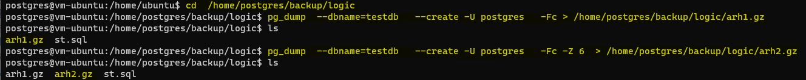

   __*Можно посмотреть размеры создаваемых бэкапов в нашем каталоге:*__
  > 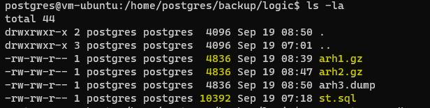
* Используя утилиту pg_restore, восстановим в новую БД только вторую таблицу!

   __*Создаю новую базу данных "newdb". При восстановлении таблицы в новой базе, она будет воссоздаваться в той же схеме, что и оригинальная таблица. По этому создаю такую же схему в новой базе данных.*__
  > 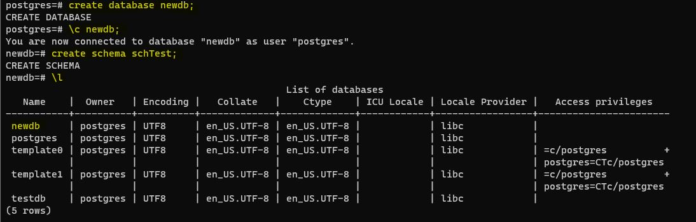

   __*С помощью утилиты pg_restore выполняю восстановление таблицы "test_copy" в новой базе данных "newdb".*__
  > 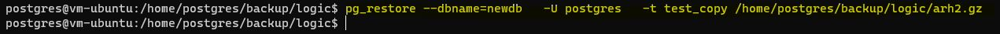

   __*Проверяю, что в новой базе данных таблица "test_copy" создалась, и что в ней есть данные.*__
  > 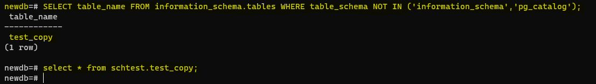
  
